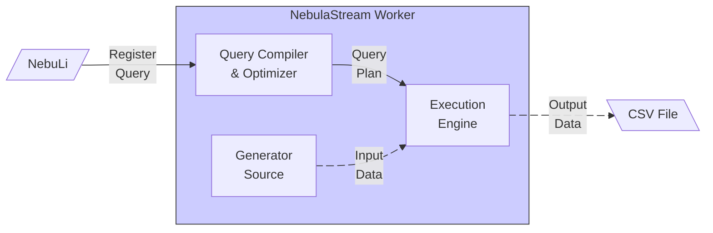
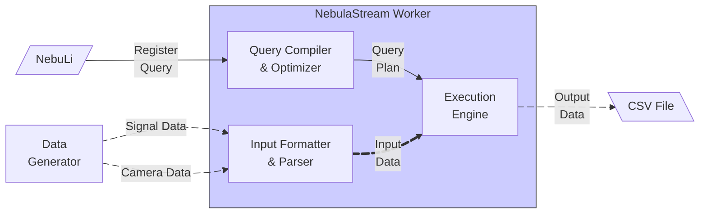

# NebulaStream Tutorial
The NebulaStream tutorial demonstrates how to download and configure NebulaStream, how to submit queries to NebulaStream, and visualize their results.

## Use Case
The tutorial is based on the [NEEDMI Demo](https://youtu.be/g1eKSqm5biU?si=iaAukkAwP8m-6Y5u), a project to showcase NebulaStream in the context of the medical domain, where signals from devices in an ICU are processed by NebulaStream.

## Installation and Execution

Prerequisites

Clone this repository

```bash
git clone https://github.com/nebulastream/nebulastream-tutorial.git
```

Run the Docker Compose

```bash
docker compose up
```

## Level 0 (Basics)
- At this level, we only run dockerized NebulaStream without any other component (only worker and nebuli).
- We explain some important concepts at this level (worker, nebuli, yaml file, query registration, source, sink, etc.).
- We use `generator source` for the generation of data, and sink results to a `CSV` file.
- We show the following queries and generator source patterns:
    - Query 1: source to sink, fixed pattern
    - Query 2: basic filtering, sinus pattern



#### Docker Command to Run Single Node NebulaStream Worker
```
docker run -d --name nes --network nes-net-tutorial -p 8080:8080 -v $(pwd)/output:/output nebulastream/worker:main --grpc=nes:8080
```

#### Docker Command to Register Query 1
```
docker run --rm --network nes-net-tutorial -v "$(pwd)/queries:/queries" nebulastream/nebuli:main -s nes:8080 register -x -i queries/source_generator_query.yaml
```

#### Docker Command to Register Query 2
```
docker run --rm --network nes-net-tutorial -v "$(pwd)/queries:/queries" nebulastream/nebuli:main -s nes:8080 register -x -i queries/source_generator_query.yaml
```

## Level 1 (End-user)
- At this level, we use different components (such as datagen) and show NebulaStream's interaction with these components.
- We use docker compose for orchestrating the whole setup.
- We showcase a meaningful use case (probably NEEDMI).
- We can visualize live results (either with NES UI or Grafana) for better comprehension.



## Level 2 (Developer)
- At this level, we go through implementing a new source in NebulaStream.
- We need to start by explaining the structure of codebase (all packages briefly, and the ones that we touch in detail).
- Then we should pick one specific source to implement and clearly explain each step in detail (no room for confusion or to guess).

