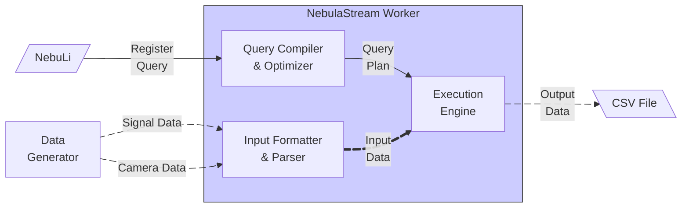

# NebulaStream Tutorial
The NebulaStream tutorial demonstrates how to download and configure NebulaStream, how to submit queries to NebulaStream, and visualize their results.

## Use Case
The tutorial is based on the [NEEDMI Demo](https://youtu.be/g1eKSqm5biU?si=iaAukkAwP8m-6Y5u), a project to showcase NebulaStream in the context of the medical domain, where signals from devices in an ICU are processed by NebulaStream.

## Installation and Execution

Prerequisites

- `git`, you can follow this [installation guide](https://git-scm.com/book/en/v2/Getting-Started-Installing-Git).
- `docker`, make sure `compose` is available in your installation

Clone this repository

```bash
git clone https://github.com/nebulastream/nebulastream-tutorial.git
```

Get the Docker Images

```bash
cd nebulastream-tutorial
docker compose pull
```

## Level 0 (Basics)
- At this level, we only run dockerized NebulaStream without any other component (only worker and nebuli).
- We explain some important concepts at this level (worker, nebuli, yaml file, query registration, source, sink, etc.) and have some way to identify every concept, e.g. for the sink a way to visualize what is happening.
- We use `generator source` for the generation of data, and sink results to a `CSV` file.
- We show the following queries and generator source patterns:
    - Query 1: source to sink, fixed pattern
    - Stop Query 1
    - Query 2: basic filtering, sinus pattern
    - Stop Query 2


#### Docker Command to Run Single Node NebulaStream Worker

We recommend to run this in a terminal to see the output and the following steps in a different terminal.

```bash
## TERMINAL 1
docker compose up nes
```

```bash
## Output
[+] Running 1/1
 ✔ Container nebulastream-tutorial-nes-1  Created                                                                                   0.0s 
Attaching to nes-1
nes-1  | [18:27:58.554183] [D] [thread 1] [BufferManager.cpp:110] [initialize] NES memory allocation requires 134217728 out of 41812262912 (so 0.32100087068351396%) available bytes
nes-1  | [18:27:58.648243] [D] [thread 1] [BufferManager.cpp:160] [initialize] BufferManager configuration bufferSize=4096 numOfBuffers=32768
nes-1  | [18:27:58.653296] [I] [thread 1] [SingleNodeWorkerStarter.cpp:83] [main] Server listening on nes:8080
```

#### Docker Command to Run the Query Result Visualizer

We prepared a Dockerized Result Visualizer that will allow to inspect the results of the queries submited to NebulaStream.

```bash
## TERMINAL 2
docker compose up sink-visualizer
```

```bash
## Output if run for the first time
[+] Running 2/2
 ✔ Container nebulastream-tutorial-nes-1              Running                                                                      0.0s 
 ✔ Container nebulastream-tutorial-sink-visualizer-1  Created                                                                      0.0s 
Attaching to sink-visualizer-1
sink-visualizer-1  | tail: can't open '/output/sink.csv': No such file or directory

```

#### Docker Command to Submit the Source Generator Query
```bash
## TERMINAL 3
docker compose up nebuli-start-source-generator
```

```bash
## TERMINAL 1 Truncated Output
...
nes-1  | [18:29:37.053140] [D] [thread 26] [PipeliningPhase.cpp:276] [apply] Constructed pipeline plan with 1 root pipelines.
nes-1  | PipelinedQueryPlan for Query: 1
nes-1  | Number of root pipelines: 1
nes-1  | ------------------
nes-1  | Root Pipeline 0:
nes-1  |   Pipeline(ID(1), Provider(COMPILER))
nes-1  |   Operator chain:
nes-1  |     PhysicalOperator(NES::SourcePhysicalOperator)
nes-1  |   Successor Pipeline:
nes-1  |     Pipeline(ID(2), Provider(None))
nes-1  |       Operator chain:
nes-1  |         PhysicalOperator(NES::SinkPhysicalOperator)
nes-1  | 
nes-1  | 
nes-1  | [18:29:37.053281] [D] [thread 26] [BufferManager.cpp:110] [initialize] NES memory allocation requires 1 out of 41812262912 (so 2.391642858710244e-09%) available bytes
...
## Here the tuples are processed
...
nes-1  | [18:29:37.057788] [D] [thread 11] [SourceThread.cpp:191] [start] Starting source with originId: 2
nes-1  | [18:29:37.057950] [D] [thread 29] [GeneratorSource.cpp:84] [fillTupleBuffer] Filling buffer in GeneratorSource.
nes-1  | [18:29:37.057958] [D] [thread 29] [GeneratorSource.cpp:103] [fillTupleBuffer] numberOfTuplesToGenerate: 10
nes-1  | [18:29:37.058008] [D] [thread 29] [GeneratorSource.cpp:139] [fillTupleBuffer] Wrote 40 bytes
nes-1  | [18:29:37.068104] [D] [thread 29] [GeneratorSource.cpp:84] [fillTupleBuffer] Filling buffer in GeneratorSource.
nes-1  | [18:29:37.068129] [D] [thread 29] [GeneratorSource.cpp:103] [fillTupleBuffer] numberOfTuplesToGenerate: 10
nes-1  | [18:29:37.068139] [D] [thread 29] [GeneratorSource.cpp:139] [fillTupleBuffer] Wrote 0 bytes
...
```

```bash
## TERMINAL 2 Output in the Result Visualizer
sink-visualizer-1  | ID:UINT64,FIELD2:UINT64
sink-visualizer-1  | 0,0
sink-visualizer-1  | 1,1
sink-visualizer-1  | 2,2
sink-visualizer-1  | 3,3
sink-visualizer-1  | 4,4
sink-visualizer-1  | 5,5
sink-visualizer-1  | 6,5
sink-visualizer-1  | 7,5
sink-visualizer-1  | 8,5
sink-visualizer-1  | 9,5
sink-visualizer-1  | tail: /output/sink.csv has appeared; following end of new file
```


#### Docker Command to Submit the Sin Wave Source Generator Query
```bash
## TERMINAL 3
docker compose up nebuli-start-source-generator-sin
```

The output will be similar to this:

```bash
[+] Running 2/2
 ✔ Container nebulastream-tutorial-nes-1                                Running0.0s 
 ✔ Container nebulastream-tutorial-nebuli-start-source-generator-sin-1  Created0.0s 
Attaching to nebuli-start-source-generator-sin-1
nebuli-start-source-generator-sin-1  | 3
nebuli-start-source-generator-sin-1 exited with code 0
```

Your will need the Query ID for the next step, this is the number indicated in this line:

```bash
nebuli-start-source-generator-sin-1  | 3  <---- This number is the Query ID
```

```bash
## TERMINAL 1 Truncated Output
...
nes-1  | [18:33:14.439451] [D] [thread 28] [PipeliningPhase.cpp:276] [apply] Constructed pipeline plan with 1 root pipelines.
nes-1  | PipelinedQueryPlan for Query: 3
nes-1  | Number of root pipelines: 1
nes-1  | ------------------
nes-1  | Root Pipeline 0:
nes-1  |   Pipeline(ID(7), Provider(COMPILER))
nes-1  |   Operator chain:
nes-1  |     PhysicalOperator(NES::SourcePhysicalOperator)
nes-1  |   Successor Pipeline:
nes-1  |     Pipeline(ID(8), Provider(None))
nes-1  |       Operator chain:
nes-1  |         PhysicalOperator(NES::SinkPhysicalOperator)
nes-1  | 
nes-1  | 
nes-1  | [18:33:14.439575] [D] [thread 28] [BufferManager.cpp:110] [initialize] NES memory allocation requires 1 out of 41812262912 (so 2.391642858710244e-09%) available bytes
nes-1  | [18:33:14.439596] [D] [thread 28] [BufferManager.cpp:160] [initialize] BufferManager configuration bufferSize=1 numOfBuffers=1
nes-1  | [18:33:14.439890] [I] [thread 28] [NodeEngine.cpp:55] [registerQuery] Register 3
nes-1  | [18:33:14.441871] [D] [thread 28] [SinkProvider.cpp:30] [lower] The sinkDescriptor is: SinkDescriptor: (name: variant(1), type: FILE, Config: input_format: CSV, append: 0, file_path: /output/test2.csv, add_timestamp: 0)
...
## Here the tuples are processed
...
nes-1  | [18:33:16.402292] [D] [thread 31] [GeneratorSource.cpp:103] [fillTupleBuffer] numberOfTuplesToGenerate: 1
nes-1  | [18:33:16.402366] [D] [thread 31] [GeneratorSource.cpp:139] [fillTupleBuffer] Wrote 9 bytes
nes-1  | [18:33:16.412474] [D] [thread 31] [GeneratorSource.cpp:84] [fillTupleBuffer] Filling buffer in GeneratorSource.
nes-1  | [18:33:16.412487] [D] [thread 31] [GeneratorSource.cpp:103] [fillTupleBuffer] numberOfTuplesToGenerate: 0
nes-1  | [18:33:16.422563] [D] [thread 31] [GeneratorSource.cpp:103] [fillTupleBuffer] numberOfTuplesToGenerate: 1
nes-1  | [18:33:16.422600] [D] [thread 31] [GeneratorSource.cpp:139] [fillTupleBuffer] Wrote 9 bytes
nes-1  | [18:33:16.432729] [D] [thread 31] [GeneratorSource.cpp:84] [fillTupleBuffer] Filling buffer in GeneratorSource.
nes-1  | [18:33:16.432747] [D] [thread 31] [GeneratorSource.cpp:103] [fillTupleBuffer] numberOfTuplesToGenerate: 0
nes-1  | [18:33:16.442824] [D] [thread 31] [GeneratorSource.cpp:103] [fillTupleBuffer] numberOfTuplesToGenerate: 1
nes-1  | [18:33:16.442852] [D] [thread 31] [GeneratorSource.cpp:139] [fillTupleBuffer] Wrote 9 bytes
...
```

```bash
## TERMINAL 3 Result Visualizer Truncated Output
...
sink-visualizer-1  | 9969,100
sink-visualizer-1  | 9970,100
sink-visualizer-1  | 9971,100
sink-visualizer-1  | 9972,100
sink-visualizer-1  | 9973,100
sink-visualizer-1  | 9974,100
sink-visualizer-1  | 9975,100
sink-visualizer-1  | 9976,100
sink-visualizer-1  | 9977,100
sink-visualizer-1  | 9978,100
sink-visualizer-1  | 9979,100
sink-visualizer-1  | 9980,100

...
```

#### Docker Command to Stop the Sin Wave Source Generator Query

To introduce the concept of the Query Life Cycle, which includes start and stop, we suggest running the Query for the sin wave again and immediately run the following command, using the Query ID as shown in the previous step.

```bash
docker compose run --remove-orphans nebuli "nes-nebuli -s nes:8080 stop 3"
```

```bash
## TERMINAL 1 Truncated Output
...
nes-1  | [18:38:27.716893] [D] [thread 32] [GeneratorSource.cpp:103] [fillTupleBuffer] numberOfTuplesToGenerate: 0
## Here the NebulaStream Worker receives the command to stop the query and proceeds to do so
nes-1  | [18:38:27.719546] [I] [thread 28] [NodeEngine.cpp:130] [stopQuery] Stop 3
nes-1  | [18:38:27.720857] [D] [thread 12] [SourceThread.cpp:230] [tryStop] SourceThread  2 : attempting to stop source
nes-1  | [18:38:27.720868] [D] [thread 12] [SourceThread.cpp:238] [tryStop] SourceThread  2 : source was not stopped during timeout
nes-1  | [18:38:27.726979] [D] [thread 32] [GeneratorSource.cpp:103] [fillTupleBuffer] numberOfTuplesToGenerate: 0
nes-1  | [18:38:27.737093] [D] [thread 32] [GeneratorSource.cpp:103] [fillTupleBuffer] numberOfTuplesToGenerate: 0
nes-1  | [18:38:27.747196] [D] [thread 32] [GeneratorSource.cpp:103] [fillTupleBuffer] numberOfTuplesToGenerate: 0
nes-1  | [18:38:27.757281] [D] [thread 32] [GeneratorSource.cpp:103] [fillTupleBuffer] numberOfTuplesToGenerate: 0
nes-1  | [18:38:27.767360] [D] [thread 32] [GeneratorSource.cpp:103] [fillTupleBuffer] numberOfTuplesToGenerate: 0
nes-1  | [18:38:27.777473] [D] [thread 32] [GeneratorSource.cpp:103] [fillTupleBuffer] numberOfTuplesToGenerate: 0
nes-1  | [18:38:27.787590] [D] [thread 32] [GeneratorSource.cpp:103] [fillTupleBuffer] numberOfTuplesToGenerate: 0
nes-1  | [18:38:27.797746] [D] [thread 32] [GeneratorSource.cpp:103] [fillTupleBuffer] numberOfTuplesToGenerate: 0
nes-1  | [18:38:27.807888] [D] [thread 32] [GeneratorSource.cpp:103] [fillTupleBuffer] numberOfTuplesToGenerate: 0
nes-1  | [18:38:27.817976] [D] [thread 32] [GeneratorSource.cpp:103] [fillTupleBuffer] numberOfTuplesToGenerate: 0
nes-1  | [18:38:27.828113] [D] [thread 32] [GeneratorSource.cpp:103] [fillTupleBuffer] numberOfTuplesToGenerate: 1
nes-1  | [18:38:27.828133] [D] [thread 32] [GeneratorSource.cpp:139] [fillTupleBuffer] Wrote 0 bytes
nes-1  | [18:38:27.836475] [I] [thread 12] [SequenceShredder.cpp:55] [~SequenceShredder] Successfully validated SequenceShredder
nes-1  | [18:38:27.836563] [D] [thread 12] [FileSink.cpp:125] [stop] Closing file sink, filePathOutput=/output/test2.csv
```

## Level 1 (End-user)
- At this level, we use different components (such as datagen) and show NebulaStream's interaction with these components.
- We use docker compose for orchestrating the whole setup.
- We showcase a meaningful use case (probably NEEDMI).
- We can visualize live results (either with NES UI or Grafana) for better comprehension.



## Level 2 (Developer)
- At this level, we go through implementing a new source in NebulaStream.
- We need to start by explaining the structure of codebase (all packages briefly, and the ones that we touch in detail).
- Then we should pick one specific source to implement and clearly explain each step in detail (no room for confusion or to guess).

